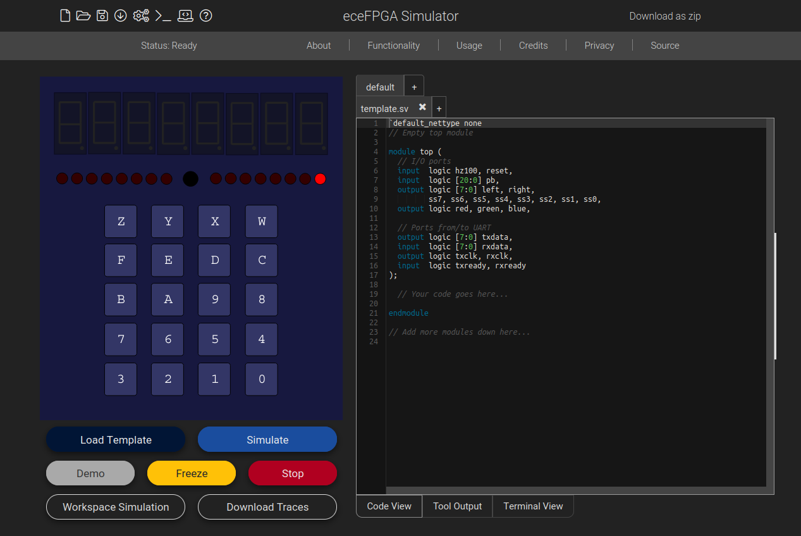

# ECE 27000 Verilog Simulator

Updated for Spring 2022.  The changelog continues to grow, so it has been moved to a CHANGELOG Markdown file.  

<br>
<p align="center">
  
</p>
<br>

**If you're a student in ECE 27000 in the current semester, read this.**  It's likely that you may find example code in here that you may feel tempted to use in lab assignments for classes if you dig deep enough.  Please don't.  You may be cited for plagiarism, unnecessarily stain your academic record, and more importantly, you won't learn anything.

This repository is essentially a backup of the ECE 270 simulator used at Purdue University, intended to simulate synthesized SystemVerilog on a virtual breakout board.  When installed, a user should navigate to localhost:4500 in a browser, enter some SystemVerilog targeted at the FPGA + breakout board the simulator is intended for, and click Simulate.  This processes the code for syntax errors using Verilator on the local server, synthesizes it with Yosys if the syntax check is successful to produce gate-level Verilog, and starts a real-time simulation of the gate-level Verilog, where inputs from the student are sent to the simulation, and outputs from the simulations are displayed on the virtual FPGA board on the webpage.

## Working hosted versions of the simulator
The most up-to-date version of the simulator, only accessible to Purdue students and staff is available at https://verilog.ecn.purdue.edu.

The public version which will only be updated every semester with the Purdue version of the simulator is hosted at https://simulator.nirajmmenon.com.

**The ece270-simulator is available as a Docker container!**  You can pull and run it with the following commands:
```
docker pull norandomtechie/ece270-simulator
docker run -d -p 4500:4500 --name 270sim norandomtechie/ece270-simulator
```

## Requirements
Any modern distribution of Linux.  The setup script included in the repo is targeted at Debian-flavored systems, but the software should theoretically work on any Linux distribution.  I use Ubuntu WSL extensively, and it's worked there as well, so if you're on Windows, download and install WSL (version 2 will work better once it's available to non-Insider builds of Windows).

~~I don't use or have a Mac, so I don't know if this works on macOS.  If you can get it working, though, I look forward to your pull request!~~

If you install Verilator, Yosys and IcarusVerilog using Homebrew, create a new folder under `/var/tmp` called `tmpcode`, install packages with `npm i` and try running the simulator with `node cluster.js` which should start it on port 4500, it *should* work.  YMMV.

## Installation
### The scripted way
Worked on Ubuntu 18.04 LTS (WSL 1/2) and Ubuntu 20.04 LTS (WSL 2 (not 1!) and baremetal install), so you can assume this works on any flavor of Debian as well.  Doesn't work on RPM-based Linux distros or ones that use yum instead of apt, though.  Run the following commands in ~ (your home directory):

```
git clone https://github.com/norandomtechie/ece270-simulator
cd ~/ece270-simulator
sudo bash setup/setup.sh
```

### The manual way
If you're UNIX-proficient and you're used to downloading and managing GitHub projects locally to prevent conflicts with other own server-based software that may be running on your computer, here's what the script achieves so that you can set it up on your own:  
  
1. Install the following software packages (preferably manually, because apt doesn't have the latest versions that we're using now):
    - [Verilator](https://github.com/verilator/verilator) - checkout the stable branch when you clone the repo.
    - [Yosys](https://github.com/YosysHQ/yosys) - currently the script clones the latest version from the master branch, but it is recommended that you confirm that the current commit was successfully built and passed checks (indicated by a green checkmark next to the 'Latest commit' tag on the Yosys GitHub page).  If it's a red cross (X), go through commits and find the last successfully built version, then checkout from that commit.  I'll be closely monitoring for a good version and update the script to only use that version later on.
    - [Icarus Verilog](https://github.com/steveicarus/iverilog) - Read section 2.2 - Compilation - on the GitHub page for Icarus, and install it to your preferred location.
    - [node](https://nodejs.org/en/download) - Fairly straightforward - download the tarball for your OS, extract it, and copy over the binaries from bin/ to /usr/bin or add it to your PATH.

2. Install the node modules with "npm i".  

3. Start the server with "sudo node cluster.js".  

#### WARNING!
This will take an extremely long time to install due to the numerous dependencies of the tools required.  Using your computer while it's installing will cause the script to take longer.  

I myself ran the script on WSL on a Windows Insider build, and playing around with other programs during compile time caused a page fault BSOD to occur.  When I left it alone, it slowly (but surely) installed all dependencies correctly and didn't have any issues.  Go figure.

So try not to use your computer as the script is running.  It won't play nice if you're doing something just as computationally expensive at the same time - streaming audio/video, or playing a game.  

I'd recommend just starting the script, walking away from your computer, and doing something non-tech-related.  Make coffee.  Pet your pet.  Try yoga.  Talk to your parents.  Do your thing.

## History
In the Fall of 2018, I took a class called ECE 270 at Purdue University, a course serving as an introduction to digital design with the use of breadboards and circuit wiring in the first half, and the use of a CPLD with breakout board (including a DIP switch, LEDs and seven-segment character displays) and Verilog-based hardware design in the second half.  

For the latter half, there were a limited number of CPLDs available to well over hundreds of students taking the course, resulting in lab overcrowding, late nights just waiting for a spot to get a lab station with a CPLD, and as a result, very little time spent on actually understanding the material and more time spent spitting out half-working Verilog that did the job on the CPLD.

With the help of my instructor, I wrote a web-based simulator for that CPLD (as well as the updated FPGA + breakout board we switched to) through the spring and summer semesters of 2019.  The purpose of this simulator is to provide a virtual breakout board that students can manipulate, as if they were working on the physical board in lab, and be able to write Verilog targeted at the FPGA beneath this breakout board.  A student would write out a Verilog design on the simulator webpage, send it to the server, which would perform syntax checks, synthesis, and start a gate-level simulation of the code to recreate the behaviour of their code as it would behave on the actual FPGA with breakout board, with the outputs of the simulation appearing on the page, and the inputs from the virtual board on the webpage getting sent back in real time.